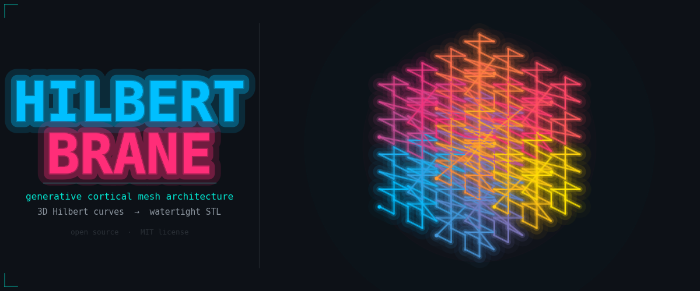
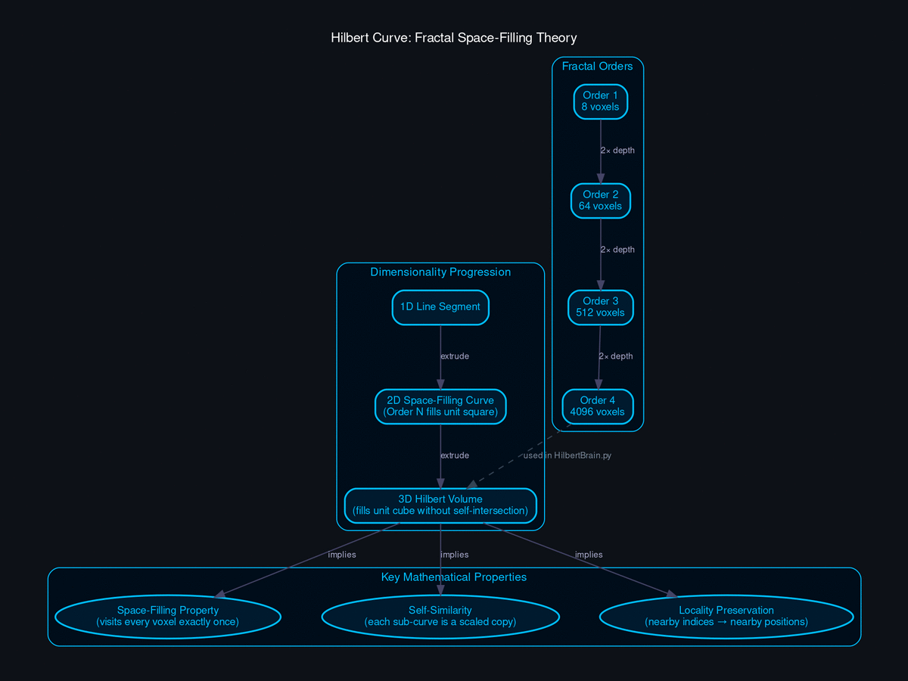
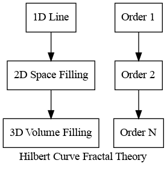
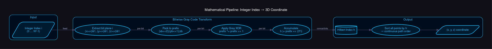
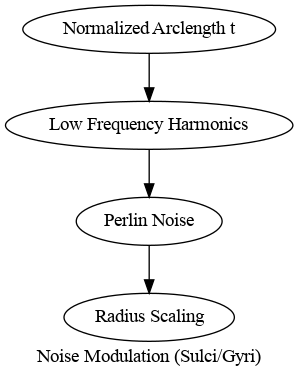
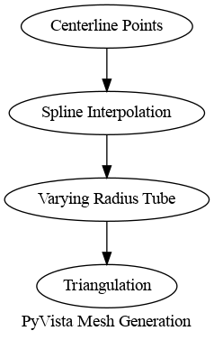
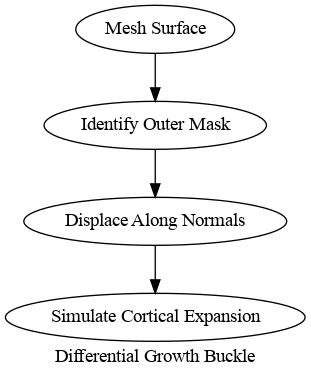
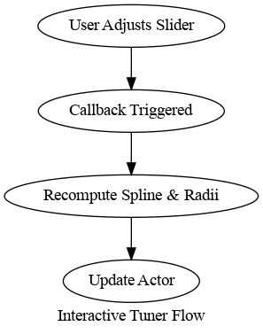
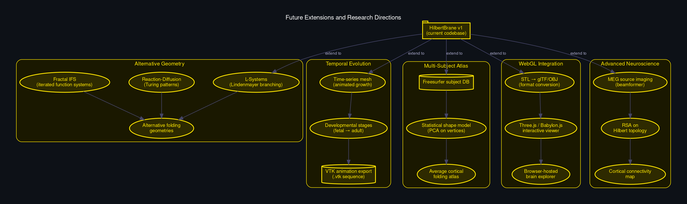
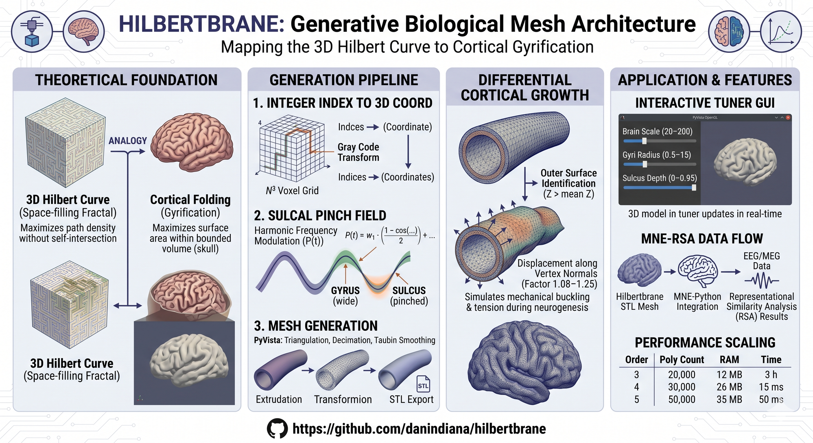

<p align="center">
  
</p>

# Hilbertbrane: A Generative Biological Mesh Architecture 🧠

<p align="center">
  <a href="https://opensource.org/licenses/MIT"></a>
  <a href="https://www.python.org/downloads/"></a>
  <a href="https://docs.pyvista.org/"></a>
  <a href="https://github.com/danindiana/hilbertbrane/stargazers"></a>
</p>

Hilbertbrane maps the continuous, space-filling properties of the **3D Hilbert Curve** through a volumetric pipeline to synthesize cortical folding patterns that parallel biological neurogenesis — producing watertight STL meshes ready for 3D printing, physics simulation, or WebGL visualization.

<p align="center">
  
</p>

<p align="center">
  
</p>

<p align="center">
  <a href="http://calisota.ai/hilbertbrane/"><strong>Browse all 25 diagrams →</strong></a>
</p>

---

## 🔬 Theoretical Background

The human cortex maximizes surface area within the constrained volume of the skull through complex folding (gyrification). Hilbert curves — a continuous fractal space-filling curve first described by David Hilbert in 1891 — exhibit a mathematically analogous property: they maximize path density within a bounded Euclidean space without self-intersection.

<p align="center">
  
</p>

By generating a 3D Hilbert curve and subjecting it to harmonic frequency modulation and Perlin noise, **Hilbertbrane** simulates the mechanical buckling and tension of cortical white matter — extruding it into a 3D watertight mesh.

---

## ⚙️ How It Works

### Step 1 — Integer Index to 3D Coordinate

Each point on the Hilbert path is decoded from an integer index via a compact bitwise Gray code transform. Every voxel in the N³ grid is visited exactly once.

<p align="center">
  
</p>

### Step 2 — Sulcal Pinch Field

A superposition of two harmonics (plus a low-frequency wobble term) creates the arclength-varying pinch field P(t) that drives sulcus/gyrus alternation along the spline:

```
P(t) = w1 × (1 - cos(2π·k1·t + φ1)) / 2
     + w2 × (1 - cos(2π·k2·t + φ2)) / 2
     + wobble term
```

The per-point tube radius is then `R × (1 − SulcusScale × P(t))`, clipped to a safe range.

<p align="center">
  
</p>

### Step 3 — PyVista Mesh Generation

The decoded path is smoothed into a continuous spline, which is then extruded into a varying-radius tube, triangulated, decimated, and Taubin-smoothed into a production-ready mesh.

<p align="center">
  
</p>

### Step 4 — Differential Cortical Growth

The outer surface (Z > mean Z) is identified and displaced along its vertex normals by a growth factor (1.08–1.25), simulating the biomechanical expansion that causes cortical buckling during development.

<p align="center">
  
</p>

---

## 🚀 Core Features & Generators

### Unified Generator (`hilbert_gen.py` + `hilbert_core.py`)

All mesh generation is now handled by a single configurable script backed by a shared core library. Four presets reproduce the original scripts exactly, and every parameter is overridable:

| Command | Equivalent to | Output |
|---------|--------------|--------|
| `python hilbert_gen.py --preset gyri` | `HilbertGyri.py` | `hilbert_gyri_o3.stl` |
| `python hilbert_gen.py --preset gyri2` | `HilbertGyri2.py` | `hilbert_gyri_o4.stl` |
| `python hilbert_gen.py --preset gyri3` | `HilbertGyri3.py` | `hilbert_brain.stl` |
| `python hilbert_gen.py --interactive` | `Hilbertbrane.py` | prompted filename |
| `python hilbert_gen.py --list-presets` | — | print preset table |

Override any knob on top of a preset:

```bash
python hilbert_gen.py --preset gyri3 --sulcus 0.6 --noise-amp 0.6 --order 5
python hilbert_gen.py --preset gyri --repair    # watertight repair via pymeshfix
python hilbert_gen.py --preset gyri2 --preview  # open interactive window after saving
```

After every save, the generator prints the open-edge count and suggests `--repair` when needed — the validation behind the print-ready claim.

`hilbert_core.py` houses all shared math (Skilling 2004 Hilbert curve, pinch field, tube builder, watertightness utils) and is importable without a GL stack, making the pure-math half unit-testable independently.

### Output Formats (`exporters.py`)

Six formats via a single `-f` / `--format` flag. Extension is inferred automatically; an explicit `--format` corrects the extension when they conflict.

| Extension / flag | Format | Extra dependency | Notes |
|-----------------|--------|-----------------|-------|
| `.stl` | STL | PyVista (always) | triangle soup, no units |
| `.ply` | PLY | PyVista (always) | preserves per-vertex scalars |
| `.3mf` | 3MF | stdlib only | units=mm, provenance metadata in XML |
| `.glb` | glTF binary | `pip install trimesh` | single self-contained file, web-ready |
| `.gltf` | glTF text | `pip install trimesh` | buffers as data URIs, one portable file |
| `.swc` | SWC skeleton | stdlib only | centreline + varying radius, neuron-morphology format |

```bash
python hilbert_gen.py --preset gyri3 -o brain.glb          # WebGL viewer
python hilbert_gen.py --preset gyri3 -o brain.3mf          # print-ready container
python hilbert_gen.py --preset gyri3 -o brain.swc          # morphology skeleton
python hilbert_gen.py --preset gyri3 -o brain.stl -f ply   # flag overrides ext
./run.sh --format glb                                       # all presets → .glb
```

Every format that supports metadata receives a provenance dict (git SHA, preset, order, spline, radius, sulcus, seed, growth mode) so any output is traceable back to the parameters that produced it.

### Browser Tuner (`tuner_trame.py`)

The old `interactive_tuner.py` required a local OpenGL display. The trame-based replacement renders off-screen on the server and streams to a browser tab — works headless, over SSH, or shared with a colleague.

```bash
python tuner_trame.py                       # http://localhost:8080
python tuner_trame.py --port 9000 --no-browser
# over SSH: ssh -L 8080:localhost:8080 user@host  then open localhost:8080
```

**UI:** a side drawer with 10 sliders (order, spline, size, radius, sulcus, k1, k2, wobble, facets, seed), an export filename field, and Export / Reset buttons. The live view shows the bare tube (no decimate/smooth/growth) for responsiveness. Export routes through `exporters.write` — same files as `hilbert_gen`, any format by extension, with a watertight-edge count in the status line.

**Fixes over the old tuner:**
- Uses `hilbert_core.build_hilbert_path` — the correct locality-preserving curve (a test asserts this)
- Reuses `hilbert_core` for the pinch field and tube builder — no duplicated code
- Actor leak fixed: `rebuild()` removes the old actor before adding the new one; `test_rebuild_swaps_in_a_single_actor` locks this down

**Optional dependency:** `pip install trame trame-vuetify trame-vtk`

<p align="center">
  
</p>

### MNE-RSA Architecture (`brain_box.py`)

Generates a dark-neon node map describing MNE-Python integration for Representational Similarity Analysis (RSA) of MEG/EEG data. See the [full MNE-RSA data flow](#).

---

## 🛠 Installation & Quickstart

```bash
# 1. Clone
git clone https://github.com/danindiana/hilbertbrane.git
cd hilbertbrane

# 2. Virtual environment
python3 -m venv venv
source venv/bin/activate
pip install -r requirements.txt

# 3. Run all presets
chmod +x run.sh
./run.sh                  # generates hilbert_gyri_o3.stl, hilbert_gyri_o4.stl, hilbert_brain.stl
./run.sh gyri3            # single preset only
./run.sh --repair         # attempt watertight repair on all outputs
```

Or run the generator directly:

```bash
python hilbert_gen.py --preset gyri3 -o my_brain.stl
python hilbert_gen.py --list-presets
python hilbert_gen.py --interactive   # prompted parameter entry
```

---

## 🎨 Visualization

View generated `.stl` files in a high-fidelity PBR 3D environment:

```bash
python view_stls.py
```

Render a headless screenshot (no display required):

```bash
python screenshot.py
```

---

## 📊 Performance Scaling

| Order | Voxels | ~Poly count | ~RAM | ~Time |
|-------|--------|-------------|------|-------|
| 3 | 512 | 50k | 5 MB | < 5 s |
| 4 | 4 096 | 300k | 150 MB | 30–60 s |
| 5 | 32 768 | > 1M | > 1 GB | minutes |

Decimation (0.30–0.45 reduction factor) brings the final STL to a printable size before export.

---

## 📂 25 Component Diagrams

All diagrams live in `docs/diagrams_25/` as `.png`, `.svg`, and `.dot` source files. A selection is shown inline above; the complete set covers:

| # | Diagram | Category |
|---|---------|----------|
| 01 | Hilbert Curve Fractal Theory | Math/Theory |
| 02 | Mathematical Pipeline (Gray Code) | Math/Theory |
| 03 | PyVista Mesh Generation | Mesh/Processing |
| 04 | Sulcal Pinch Field (Harmonic + Perlin) | Neuroscience |
| 05 | MNE-RSA Integration Pipeline | Neuroscience |
| 06 | Interactive Tuner GUI Flow | UI/Interaction |
| 07 | Project Directory Structure | Infrastructure |
| 08 | Mesh Decimation & Smoothing | Mesh/Processing |
| 09 | Differential Cortical Growth | Neuroscience |
| 10 | Performance & Memory Scaling | Performance |
| 11 | Script Dependency Hierarchy | Infrastructure |
| 12 | Ellipsoid Bounding Box Mapping | Math/Theory |
| 13 | PBR Material & Lighting Pipeline | Materials |
| 14 | Headless/Offline Screenshot Pipeline | Infrastructure |
| 15 | Git Version Control Workflow | Infrastructure |
| 16 | MNE-RSA Complete Data Flow | Neuroscience |
| 17 | Ventricle Thinning Mask | Neuroscience |
| 18 | Tube Surface Normals & Geometry | Mesh/Processing |
| 19 | Parameter Interaction & Trade-offs | Math/Theory |
| 20 | User Deployment Workflow | Infrastructure |
| 21 | vary_radius API Fallback Logic | Infrastructure |
| 22 | STL Export Pipeline | Mesh/Processing |
| 23 | CLI Parameter Prompting Interface | UI/Interaction |
| 24 | Hardware Acceleration Stack | Infrastructure |
| 25 | Future Extensions & Research Directions | Future |

Regenerate all diagrams at any time:

```bash
python generate_25_diagrams.py
```

View the full interactive gallery at **[calisota.ai/hilbertbrane](http://calisota.ai/hilbertbrane/)** — each card links to the full-size PNG and vector SVG source.

### Future Directions

<p align="center">
  
</p>

Planned extensions include L-systems, reaction-diffusion Turing patterns, temporal developmental animations, multi-subject cortical atlases, and a browser-hosted WebGL viewer.

---

## 🖼 Infographics

### Project Overview

<p align="center">
  
</p>

### MNE-RSA Architecture

<p align="center">
  
</p>

Source files live in [`docs/infographics/`](docs/infographics/).

---

## 🧠 Neuroimaging Interoperability (`neuro.py`)

The SWC neuron-morphology writer lives in `exporters.py`. `neuro.py` adds the surface- and volume-level neuro formats so the generated geometry speaks directly to neuroimaging toolchains.

```bash
python hilbert_gen.py --preset gyri3 --neuro gii     -o brain   # brain.surf.gii + brain.shape.gii
python hilbert_gen.py --preset gyri3 --neuro nii     -o brain   # brain.nii.gz (traversal index volume)
python hilbert_gen.py --preset gyri3 --neuro graphml -o brain   # brain.graphml
python hilbert_gen.py --preset gyri3 --neuro gexf --neuro-knn 6 -o brain  # + spatial kNN edges
```

| Format | Flag | Dependency | Output | Opens in |
|--------|------|-----------|--------|----------|
| GIFTI surface | `--neuro gii` | nibabel | `.surf.gii` + `.shape.gii` overlay | FreeView, Connectome Workbench, MNE, nilearn, pycortex |
| NIfTI volume | `--neuro nii` | nibabel | `.nii.gz` — traversal-index gradient | 3D Slicer, FSL, nilearn |
| GraphML | `--neuro graphml` | networkx | `.graphml` | NetworkX, igraph, BCT |
| GEXF | `--neuro gexf` | networkx | `.gexf` | Gephi, NetworkX |

**GIFTI overlay:** the pinch field is resampled onto every final-mesh vertex by nearest centerline point (scipy KD-tree), so it stays correct after decimation. Falls back to mesh mean curvature when scipy is absent.

**NIfTI voxel content:** the curve is space-filling so occupancy is uniformly 1 and useless; the volume stores each cell's *normalised traversal index* instead — a dense scalar gradient that snakes through the cube and is informative in a volume viewer.

**Graph:** `--neuro-knn k` adds spatial edges to each node's *k* nearest neighbours in addition to the path chain, turning the trivial sequence into a graph where geodesic and path distance diverge — the interesting regime for BCT/igraph analysis.

**Honesty:** these formats imply interoperability, not anatomical fidelity. This is generative geometry that speaks neuro formats for visualisation, teaching, and pipeline testing.

**Optional dependencies:** `pip install nibabel networkx scipy`

---

## 🔬 FEM / Morphoelastic Scaffolding (`morphoelastic.py`)

The vertex-displacement growth in `hilbert_gen.py` *simulates* cortical folding geometrically. The real phenomenon — growth-induced mechanical buckling of a thin fast-growing cortex over a slower core (Tallinen, Chung, Biggins & Mahadevan, 2014) — requires a nonlinear FEM solver. `morphoelastic.py` does the honest, solver-agnostic part:

```
surface mesh  →  (repair to watertight)  →  tetrahedral volume mesh
              →  cortical growth field g(x)  →  FEM input file
```

Activate via the `--fem` flag in `hilbert_gen.py`:

```bash
python hilbert_gen.py --preset gyri --repair --fem vtu -o brain.vtu
python hilbert_gen.py --preset gyri --repair --fem feb -o brain.feb \
    --cortical-thickness 0.3 --fem-growth-rate 1.4
```

| FEM format | Dependency | Notes |
|-----------|-----------|-------|
| `.vtu` | meshio | VTK unstructured grid; growth field round-trips |
| `.msh` | meshio | Gmsh format; growth field round-trips |
| `.inp` | meshio | Abaqus; geometry only (meshio drops point data) |
| `.feb` | stdlib | FEBio XML; geometry + growth field + clearly-marked stub material/BC/solver blocks |

The growth field ramps from 1.0 in the core to `--fem-growth-rate` at the surface — the thin-fast-cortex-over-slow-core differential that drives the Tallinen–Mahadevan instability. It is an **isotropic scalar proxy**; a faithful model needs an anisotropic tangential growth tensor in the solver. The `.feb` output loads in FEBio Studio for inspection but contains `<!-- SCAFFOLD: ... -->` comments and TODO stubs that must be completed before a run means anything.

`tetrahedralize()` requires the surface to be watertight — it repairs with `pymeshfix` and refuses to proceed if the repair fails, so `--fem` forces the quality gate that `--repair` otherwise makes optional.

**Optional dependencies:** `pip install tetgen pymeshfix meshio`

---

## 🔖 Provenance & Reproducibility (`provenance.py`)

Every output is fully determined by its resolved config + seed, so every file can carry exactly what's needed to recreate it.

```bash
# generate with full provenance sidecar (default)
python hilbert_gen.py --preset gyri3 --noise-amp 0.4 --seed 123 -o brain.ply
# → writes brain.ply  +  brain.ply.provenance.json

# regenerate bit-identically from the sidecar
python hilbert_gen.py --from-provenance brain.ply.provenance.json -o rebuilt.ply
```

The `--from-provenance` path was verified end-to-end: regenerating a Perlin-noise mesh from its sidecar produced 80,064 bit-identical vertices (`np.array_equal`).

**What the record contains:** tool name + version, git SHA (`-dirty` suffixed on uncommitted trees), ISO timestamp, the exact CLI command, and the **complete** resolved config (all 36 fields, tuples made JSON-safe).

**Embedding by format:**

| Format | Where it goes |
|--------|--------------|
| 3MF | `<metadata>` entries (full record in `provenance_json` field) |
| glTF / GLB | `asset.extras` (fixed: trimesh's `tm.metadata` doesn't reach the file; now injected via `tree_postprocessor`) |
| PLY | `comment` lines spliced into the header — binary data untouched, mesh still loads |
| SWC / FEBio | header comments |
| GIFTI | `GiftiMetaData` |
| GraphML / GEXF | graph attributes |
| STL, NIfTI, .msh/.inp/.vtu | no metadata slot → sidecar only |

**`--provenance {none,embed,sidecar,both}`** (default `both`) — opt out of sidecar with `none`.

---

## 🧪 Testing

97 tests across seven files. Run from the repo root after activating the venv:

```bash
python -m pytest          # all tests
python -m pytest -q       # quiet summary
python -m pytest tests/test_core.py   # pure-math only (no PyVista needed)
```

| File | Tests | Dependencies | What it guards |
|------|-------|-------------|----------------|
| `tests/test_core.py` | 12 | numpy only | Hilbert curve locality (the old Gray-code bug), field invariants |
| `tests/test_exporters.py` | 21 | PyVista + optional trimesh | Round-trip per format, 3MF OPC structure, glTF sidecar-free |
| `tests/test_pipeline.py` | 8 | PyVista + optional trimesh | Full `generate()` → export integration at order 2 |
| `tests/test_morphoelastic.py` | 14 | PyVista + optional tetgen/meshio | Tet meshing, growth field ramp, FEM format round-trips, scaffold honesty |
| `tests/test_neuro.py` | 26 | PyVista + optional nibabel/networkx/scipy | GIFTI round-trip, overlay source preference, NIfTI bijective gradient, graph chain + kNN edges, graphml/gexf round-trips |
| `tests/test_tuner.py` | 8 | PyVista + optional trame | Config sanity, geometry correctness, radius clip, path caching, correct-curve guard, app builds, actor-leak fix, export writes file |
| `tests/test_provenance.py` | 8 | numpy + optional PyVista | Record completeness, flatten/JSON round-trip, sidecar load-by-path, PLY embedding preserves mesh, `--provenance none` opt-out, bit-identical regeneration |

The key regression guard is `test_hilbert_curve_is_locality_preserving`, parametrized over orders 2/3/4. It asserts every consecutive step is Manhattan-distance 1 and the curve is a bijection onto the grid — both clauses fail immediately if the compact Gray-code interleave is reintroduced.

Optional dependencies (trimesh) are handled with `importorskip` — the 4 glTF/GLB tests skip cleanly in a minimal environment rather than erroring, so a bare `pip install numpy pytest` box still guards the 12 core curve tests.

---

## 📄 License

MIT — see [LICENSE](LICENSE) for details.
